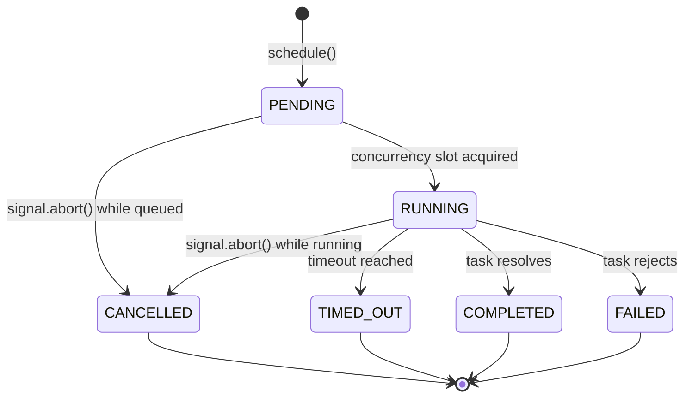

# Architecture Specification — @mrjacket/ahko

## 1. Overview & Philosophy

`@mrjacket/ahko` is a low-energy task scheduler for JavaScript and TypeScript.

> "Let your code chill."

The library controls **when** asynchronous work executes, **how much** work runs concurrently, and **how** cancellation and lifecycle transitions behave. It does not pretend to magically reduce CPU cost; instead, it prevents bursty overload and coordinates asynchronous operations through explicit policies.

---

## 2. Core Architectural Principles

### 2.1 Single Unified Scheduler Core
All strategies (`immediate`, `delay`, and future strategies like `idle`, `throttle`, `debounce`, and `retry`) compose on **one single scheduler engine** and converge on a single task lifecycle. There are no separate disconnected scheduling engines.

```text
Task
  ↓
Scheduler (TaskRunner + TaskQueue)
  ↓
Strategy / Policy (Immediate, Delay, ...)
  ↓
Execution & AbortSignal Propagation
  ↓
Lifecycle Transition (COMPLETED | FAILED | CANCELLED | TIMED_OUT)
  ↓
Cleanup (Listeners, Timers, References)
```

### 2.2 Native Platform Primitives
- Zero external runtime dependencies.
- Native `AbortController` and `AbortSignal` for cancellation coordination.
- Node.js (>= 22.12): `setImmediate`, `setTimeout`, native microtasks.
- Browser: `requestIdleCallback` (with fallback to `setImmediate` or `setTimeout(..., 0)`).

### 2.3 Explicit Semantics
- **Concurrency vs Rate Limit**: Concurrency limits how many tasks execute simultaneously. Rate limiting controls how frequently tasks begin.
- **Delay vs Throttle**: Delay waits before executing one task. Throttle limits how often repeated calls execute over time.
- **Debounce vs Throttle**: Debounce waits until incoming calls stop. Throttle enforces a maximum frequency while calls keep arriving.
- **Cancellation vs Timeout**: Cancellation is an external request to stop/abort. Timeout is scheduler-initiated cancellation after a set duration.

---

## 3. Confirmed Architectural Decisions

### A. Debounce: Promise Coalescing / Shared Execution
- Scheduling multiple tasks with the same `key` within the debounce window coalesces into one execution.
- All callers awaiting that `key` share the exact same returned Promise (resolving or rejecting with the outcome of that execution).
- Superseded calls are **not** rejected with `AhkoCancellationError`; they are gracefully coalesced.

### B. Memory Safety Guarantees
- Every listener, timer, queue entry, and debounce entry must have explicit cleanup.
- Abort event listeners registered on user-supplied `AbortSignal` instances are removed immediately once a task settles (`COMPLETED`, `FAILED`, `CANCELLED`, or `TIMED_OUT`).
- Debounce tracking tables delete settled keys immediately.
- No task closures or settled promises are retained in memory.

### C. Idle Scheduling Abstraction (`IdleScheduler`)
- Abstracted platform-agnostic interface:
  - Browser: `requestIdleCallback` when present.
  - Node.js: `setImmediate` as primary scheduling primitive.
  - Fallback: `setTimeout(..., 0)`.
- Never assume browser globals in Node.js or Node-specific globals in browsers.

### D. Debounce Identity
- Explicit `key` parameter (string or symbol) determines coalescing identity.
- Function identity (`fn1 === fn2`) is never used.

---

## 4. Task Lifecycle State Machine

Each scheduled task moves through deterministic lifecycle states:



- Concurrency slots are acquired strictly when entering `RUNNING`.
- Slots are guaranteed to be released when transitioning out of `RUNNING` (to `COMPLETED`, `FAILED`, `CANCELLED`, or `TIMED_OUT`).
- Pending cancellations remove the task from the queue immediately without consuming a concurrency slot.
